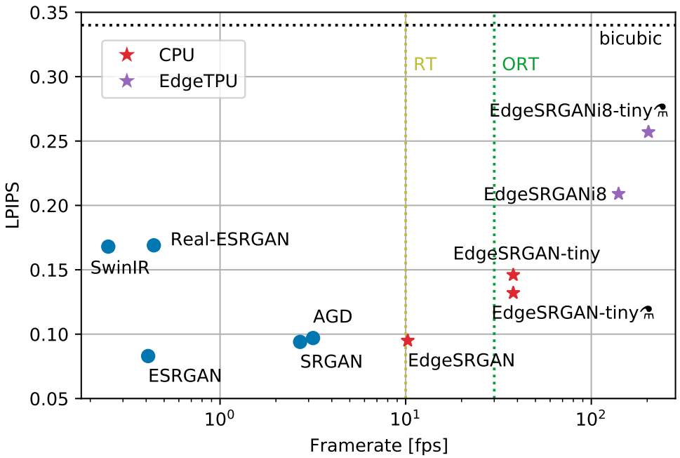
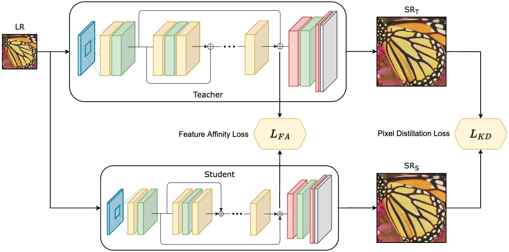

# EdgeSRGAN

[Generative Adversarial Super-Resolution at the Edge with Knowledge Distillation](https://arxiv.org/abs/2209.03355)

<p>
    
</p>

*LPIPS results (lower is better) on Set5 vs. framerate (80 × 60 input) of different visual-oriented SISR methods for upsampling. Real-time (RT) and over-real-time (ORT) framerates are marked as references. Our models, marked with ★, reach real-time performance with a competitive perceptual similarity index on the CPU. Edge TPU models can further increase inference speed far beyond real-time, still outperforming the bicubic baseline.*

## Abstract
Single-Image Super-Resolution can support robotic tasks in environments where a reliable visual stream is required to monitor the mission, handle teleoperation or study relevant visual details. In this work, we propose an efficient Generative Adversarial Network model for real-time Super-Resolution, called EdgeSRGAN. We adopt a tailored architecture of the original SRGAN and model quantization to boost the execution on CPU and Edge TPU devices, achieving up to 200 fps inference. We further optimize our model by distilling its knowledge to a smaller version of the network and obtain remarkable improvements compared to the standard training approach. Our experiments show that our fast and lightweight model preserves considerably satisfying image quality compared to heavier state-of-the-art models. Finally, we conduct experiments on image transmission with bandwidth degradation to highlight the advantages of the proposed system for mobile robotic applications.

<p>
    
    <em>EdgeSRGAN distillation process.</em>
</p>

## Description
This repository allows to train and test EdgeSRGAN on different Single Image Super-Resolution datasets using adversarial training combined with feature-wise Knowledge Distillation.

## Installation
We suggest to use a virtual environment (conda, venv, ...)
```
git clone git@github.com:PIC4SeR/EdgeSRGAN.git
pip install -r requirements.txt
```

## Usage
### Configuration
To set all the training/testing parameters modify the configuration file:
```
nano config.yaml
```

### Training
Run the following command to train EdgeSRGAN on DIV2K:
```
python main.py
```

### Test
Run the following command to test EdgeSRGAN on all the included SISR test datasets:
```
sh test.sh
```

### Weights
Pretrained weights are available at [this link](https://drive.google.com/drive/folders/1E21iZ2apadpS--zh8PHRCM4DVuIKdOOJ?usp=sharing).

* `edgesrgan.h5`: float32 TF weights
* `edgesrgan.tflite`: float16 TFLite model for inference on CPU
* `edgesrgan_int8.tflite`: int8 TFLite model for inference on Coral EdgeTPU

## Examples
<p>
    
    <em>Visual comparison of bicubic image SR (x4) methods on random samples from the considered datasets. EdgeSRGAN achieves results that are comparable to state-of-the-art solutions with ~10% of the weights.</em>
</p>


## Acknowledgments
This repository is intended for research scopes. If you use it for your research, please cite our paper using the following BibTeX:
```
@article{angarano2023generative,
title = {Generative Adversarial Super-Resolution at the edge with knowledge distillation},
journal = {Engineering Applications of Artificial Intelligence},
volume = {123},
pages = {106407},
year = {2023},
issn = {0952-1976},
author = {Simone Angarano and Francesco Salvetti and Mauro Martini and Marcello Chiaberge}}
```
We would like to thank the Interdepartmental Center for Service Robotics [PIC4SeR](https://pic4ser.polito.it), Politecnico di Torino.
